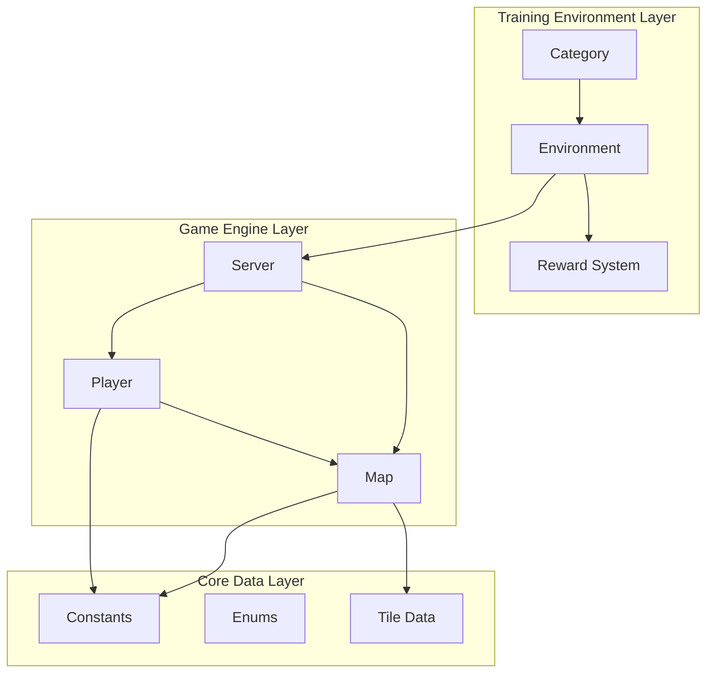
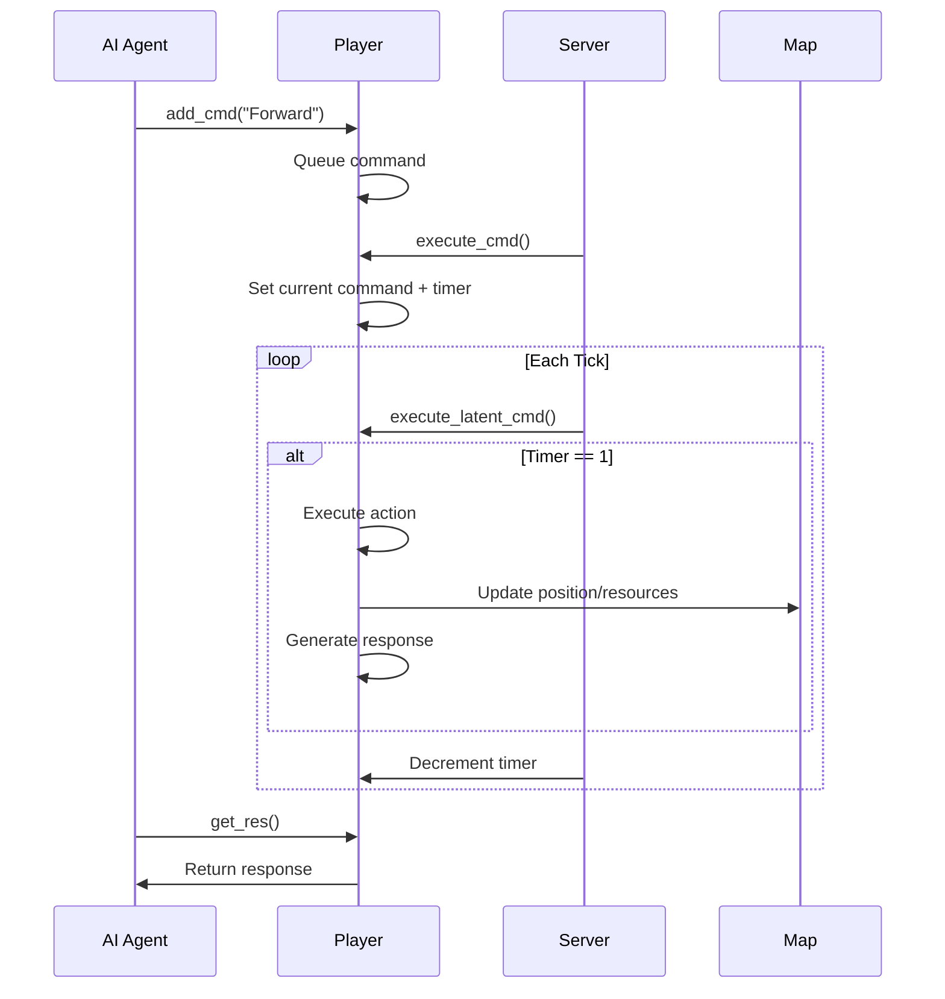
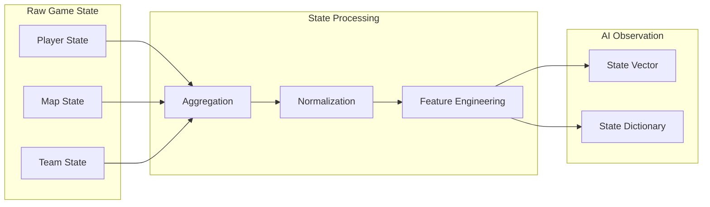
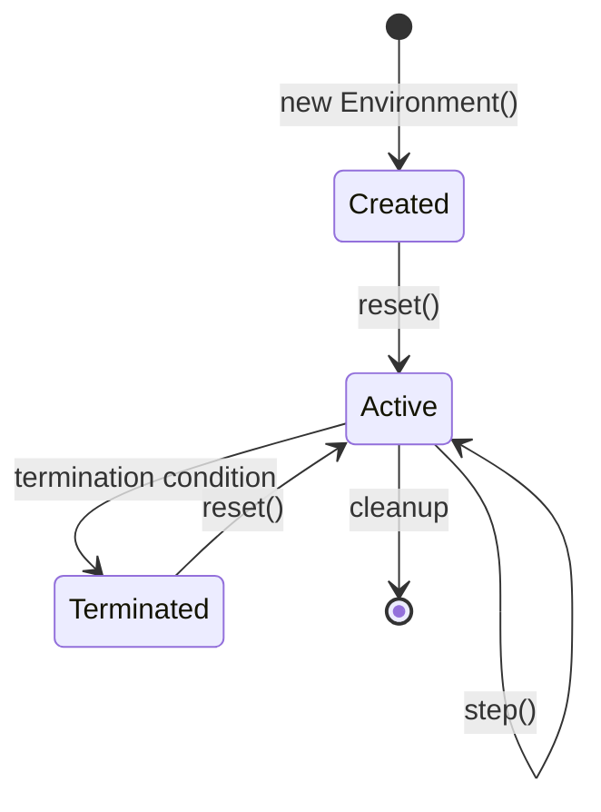

# Architecture Overview

This document provides a comprehensive overview of the Zappy AI Training Environment architecture, including design principles, component interactions, and data flow.

## System Architecture



## Core Components

### 1. Environment Layer

#### Environment Base Class
The `Environment` class provides the foundation for all training scenarios:

```python
class Environment:
    """
    Base environment class for AI training.
    Handles simulation lifecycle and reward calculation.
    """
    
    # Core simulation loop
    def reset(self) -> dict          # Initialize new episode
    def step(self) -> tuple          # Advance simulation one tick
    def get_state(self) -> dict      # Current environment state
    
    # Customization points
    def _setup(self) -> None         # Environment-specific initialization
    def _compute_reward(self, ...) -> float  # Reward calculation
    def _check_termination(self) -> bool     # Episode end conditions
```

**Key Responsibilities:**
- Episode lifecycle management
- State observation generation
- Reward computation and distribution
- Termination condition checking

#### Category System
Pre-configured environment types with specialized behaviors:

```python
Category = {
    "alone": AloneEnvironment,
    "group": GroupEnvironment,
    "random_group": RandomGroupEnvironment,
    "survival": SurvivalEnvironment,
    "incantation": IncantationEnvironment,
    "close_incantation": CloseIncantationEnvironment,
}
```

Each category inherits from `Environment` and overrides:
- `_setup()`: Initial conditions
- `_compute_reward()`: Specialized reward functions
- `_check_termination()`: Custom end conditions

### 2. Game Engine Layer

#### Server
Central coordinator for game simulation:

```python
class Server:
    """
    Main game engine managing players, map, and simulation state.
    """
    
    def __init__(self, size: int, nb_eggs: int, teams: list[str])
    def step(self) -> None           # Process one simulation tick
    def add_player(self, team: str) -> Player | None
    def clone(self) -> Server        # Deep copy for environment resets
```

**Responsibilities:**
- Player lifecycle management
- Command execution scheduling
- Incantation processing
- Game state advancement

#### Player
Individual game entity with actions and state:

```python
class Player:
    """
    Game participant with movement, resource, and communication abilities.
    """
    
    # State
    position: tuple[int, int]
    direction: Direction
    level: int
    inventory: dict[str, int]
    is_alive: bool
    
    # Command system
    command_queue: list[tuple[Callable, list[str]]]
    response_queue: list[str]
    
    # Actions (11 core commands)
    def forward(self) -> None
    def left(self) -> None
    def right(self) -> None
    # ... resource, communication, special commands
```

**Design Patterns:**
- **Command Pattern**: Actions queued and executed with timing
- **Observer Pattern**: Responses generated for AI observation
- **State Pattern**: Behavior changes based on level and resources

#### Map
Spatial game world with resources and tiles:

```python
class Map:
    """
    Game world representation with resources, eggs, and incantations.
    """
    
    tiles: list[list[dict[Resource, int]]]        # 2D resource grid
    incanted_tile: dict[tuple, IncantationTile]   # Active rituals
    eggs_tile: dict[str, list[tuple]]             # Team spawn points
    
    def clone(self) -> Map
    def evolve(self, tile: IncantationTile, coords: tuple) -> None
```

**Features:**
- Toroidal topology (wrapping edges)
- Dynamic resource distribution
- Incantation state tracking
- Team-based spawn management

### 3. Data Flow Architecture

#### Command Processing Pipeline



#### State Observation Flow



## Design Principles

### 1. Separation of Concerns

- **Environment Layer**: AI training interface
- **Game Engine**: Core simulation logic
- **Data Layer**: Constants and configurations

### 2. Modularity and Extensibility

```python
# Easy to add new environment types
class CustomEnvironment(Environment):
    def _setup(self):
        # Custom initialization
        pass
    
    def _compute_reward(self, player, prev_state):
        # Custom reward logic
        return reward

# Register new environment
Category["custom"] = CustomEnvironment
```

### 3. Performance Optimization

- **Memory Efficiency**: Object pooling for frequently created objects
- **Computation Efficiency**: Minimal state copying, efficient lookups
- **Simulation Speed**: No network overhead, optimized command processing

### 4. Deterministic Simulation

- **Reproducible Results**: Seed-based random generation
- **Consistent Behavior**: Deterministic command execution order
- **Testing Support**: Predictable outcomes for unit tests

## Memory Management

### Object Lifecycle



### State Cloning Strategy

The environment supports deep state cloning for:
- Rollback capabilities
- Parallel simulations
- A/B testing scenarios

```python
def clone_environment(env):
    """Create independent copy of environment state"""
    cloned_server = env.server.clone()
    cloned_env = type(env).__new__(type(env))
    cloned_env.server = cloned_server
    cloned_env.players = cloned_server.players
    cloned_env.map = cloned_server.map
    return cloned_env
```

## Error Handling and Robustness

### Error Recovery Mechanisms

1. **Invalid Commands**: Ignored with logging
2. **Resource Conflicts**: Atomic operations with rollback
3. **State Inconsistencies**: Validation and correction
4. **Player Death**: Graceful removal from active simulation

### Fault Tolerance

```python
class RobustEnvironment:
    def step(self):
        try:
            # Normal simulation step
            return self._safe_step()
        except GameStateError as e:
            # Recover from known issues
            self._recover_state()
            return self._safe_step()
        except Exception as e:
            # Log and continue with degraded state
            self._log_error(e)
            return self._minimal_step()
```

## Performance Characteristics

### Simulation Speed
- **Target**: 10,000+ steps/second on modern hardware
- **Bottlenecks**: Map lookups, player command processing
- **Optimizations**: Spatial indexing, command batching

### Memory Usage
- **Per Player**: ~1KB (state + queues)
- **Per Tile**: ~100 bytes (resource counts)
- **Total Environment**: ~10MB for large simulations

### Scalability Limits
- **Players**: 1,000+ simultaneous players
- **Map Size**: 100x100 tiles efficiently
- **Simulation Length**: Unlimited with periodic cleanup

## Integration Points

### AI Framework Integration

```python
# Gym-style interface
class GymWrapper:
    def __init__(self, env_name, **kwargs):
        self.env = Category[env_name](**kwargs)
    
    def reset(self):
        state = self.env.reset()
        return self._state_to_observation(state)
    
    def step(self, action):
        # Convert action to command
        # Execute step
        # Return obs, reward, done, info
```

### External Tool Integration

- **Logging**: Structured logging for analysis
- **Metrics**: Performance and behavior metrics
- **Visualization**: State rendering and replay
- **Configuration**: External parameter files

This architecture provides a robust, scalable foundation for AI training while maintaining clear separation between game logic and training infrastructure.
