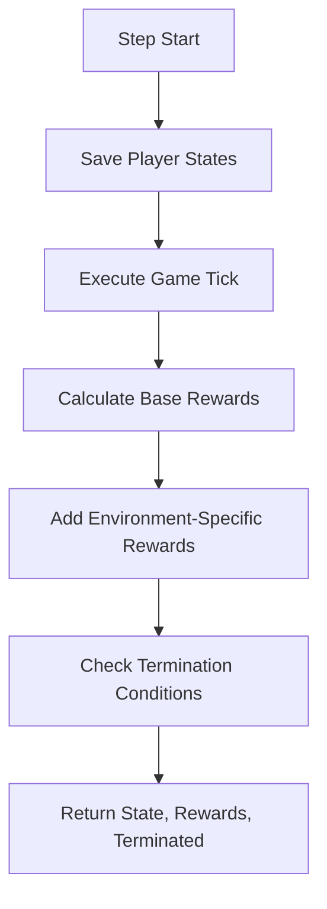

# Reward System for Zappy AI Training Environment

The reward system is designed to guide AI agents toward desired behaviors in the Zappy game environment. Each environment type has a tailored reward function that incentivizes specific objectives while penalizing negative outcomes.

## Core Reward Components

### Base Rewards (Common to All Environments)
- **Step Penalty**: `-0.01 * ticks / 7` per step to encourage efficiency
- **Death Penalty**: `-100` when a player dies
- **Level Progression**: `+10` per level gained
- **Food Collection**: `+1.0` per food item collected

## Environment-Specific Rewards

### 1. Alone Environment
- **Level Up Bonus**: `+5` for reaching a new level
- **Termination Conditions**:
  - Player dies
  - Player reaches max level (8)

### 2. Alone with Connect Slots
- **Fork Reward**: `+2` for using the fork command
- Inherits Alone environment rewards and termination conditions

### 3. Group Environment
- **Communication Reward**: `+0.5` for broadcasting
- **Team Proximity Reward**: `+0.1` for being near teammates
- **Termination Condition**: Any player reaches next level

### 4. Random Group Environment
- **Helping Reward**: `+0.2` for higher-level players assisting others
- Inherits Group environment rewards and termination conditions

### 5. Survival Environment
- **Low Food Penalty**: `-0.5` when food < 2
- **Critical Food Reward**: `+1.0` for finding food when critically low (<3)
- **Termination Condition**: All players die

### 6. Incantation Environment
- **Incantation Start**: `+5` for initiating ritual
- **Resource Readiness**: `+2` for having required resources
- **Termination Conditions**:
  - Incantation starts
  - Requirements fail

### 7. Close to Incantation Environment
- **Resource Collection**: `+1.5` for gathering missing resources
- **Resource Delivery**: `+1.0` for bringing resources to center
- Inherits Incantation environment rewards and termination conditions

## Reward Calculation Process



## Reward Design Philosophy

1. **Progressive Incentives**:
   - Small rewards for foundational actions
   - Larger rewards for significant achievements
   - Exponential rewards for major milestones

2. **Balanced Penalties**:
   - Mild penalties for inefficiency
   - Severe penalties for catastrophic failures
   - Context-sensitive penalties based on environment

3. **Behavior Shaping**:
   - Encourages exploration when safe
   - Promotes resource management
   - Rewards cooperation in team environments
   - Incentivizes risk-taking in critical situations

## Example Reward Scenarios

### Survival Environment
```
Player starts with 2 food
Step 1: Finds food → Reward: +1.0 (food collection)
Step 2: Food drops to 1 → Penalty: -0.5 (low food)
Step 3: Finds food → Reward: +1.0 (food collection) +1.0 (critical food bonus)
Total Reward: +1.5
```

### Incantation Environment
```
Player gathers resources → Reward: +2 (resource readiness)
Player starts incantation → Reward: +5 (incantation start)
Total Reward: +7
```

### Group Environment
```
Player moves near teammate → Reward: +0.1 (proximity)
Player broadcasts message → Reward: +0.5 (communication)
Teammate levels up → Environment terminates with success
Total Reward: +0.6
```

## Customizing Rewards

To adjust rewards for your training needs:

```python
class CustomEnvironment(EnvironmentAlone):
    def _compute_reward(self, player, prev_state):
        # Start with base rewards
        reward = super()._compute_reward(player, prev_state)
        
        # Add custom reward for specific behavior
        if player.position == (0,0):
            reward += 2.0  # Bonus for reaching corner
        
        # Custom penalty
        if player.inventory[constant.Resource.LINEMATE.value] > 3:
            reward -= 0.5  # Penalize hoarding
            
        return reward
```

## Best Practices for Training

1. **Start Simple**: Begin with Alone environments before progressing to complex scenarios
2. **Monitor Reward Distribution**: Ensure no single reward dominates the learning process
3. **Adjust for Exploration**: Temporarily increase step penalty if agent is too passive
4. **Balance Rewards**: Scale environment-specific rewards relative to base rewards
5. **Use Reward Shaping**: Gradually introduce complex rewards as agent improves

This reward system provides a comprehensive framework for training AI agents to master the various challenges in the Zappy game environment while promoting efficient learning and meaningful skill development.